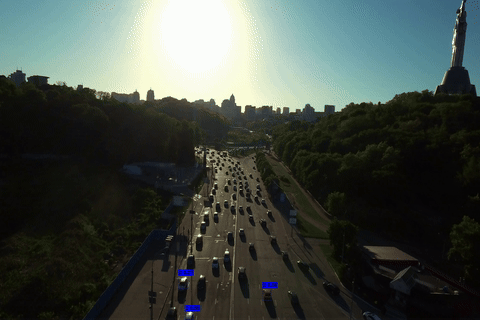
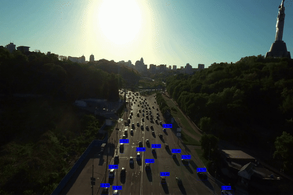
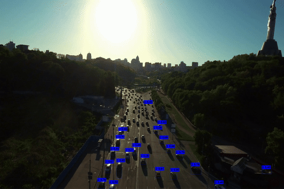
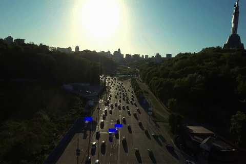
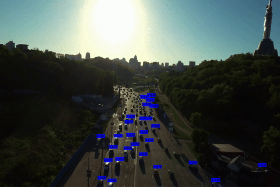
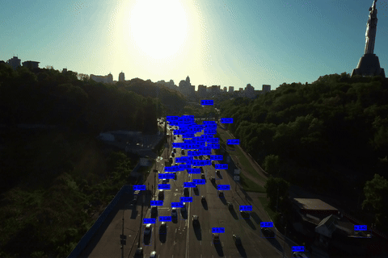

# Сравнительный анализ алгоритмов многообъектного отслеживания

Пайплайн многообъектного трекинга (детектор семейства YOLO + OC-SORT) для
NVIDIA Jetson и x86, оптимизированный под TensorRT. Репозиторий состоит из
двух частей:

- **Python-скрипты** (`scripts/`) — сравнение детекторов YOLO/YOLO-NAS на
  COCO, конвертация моделей в ONNX/TensorRT engine, профилирование графа и
  анализ загрузки GPU (tegrastats).
- **Нативная реализация на C++** (`native/`) — инференс на TensorRT/OpenCV_DNN,
  порт трекера OC-SORT (Eigen), батчевый SAHI для мелкомасштабных объектов на
  видео высокого разрешения, RTSP-сервер/клиент на GStreamer для прогона
  пайплайна на живом потоке.

Подробности методологии сравнения детекторов и трекеров — в тексте выпускной
квалификационной работы, ключевые результаты замеров — в разделе
[Результаты](#результаты).

<p align="left" width="100%">
    
    
    
</p>
<p align="center" width="100%">
    Пример работы OC-SORT + YOLO11s на видеоряде с разрешением 3840x2160 для батчей: 1, 4, 16
</p>

<p align="left" width="100%">
    
    
    
</p>
<p align="center" width="100%">
    Пример работы OC-SORT + YOLO11s(VisDrone) на видеоряде с разрешением 3840x2160 для батчей: 1, 4, 16
</p>

## Результаты

Все замеры производительности выполнены на **NVIDIA Jetson AGX Orin 64 ГБ**
(JetPack 5.1.2, режим MAXN, `jetson_clocks` включён).

**Итог:** YOLO11s (TensorRT FP16) + OC-SORT + SAHI на 4K-потоке (3840x2160)
даёт **25.9 FPS** при нарезке кадра на 2 слайса и **+6 HOTA** для класса `car`
на KITTI по сравнению с инференсом без SAHI.

### Финальный пайплайн на 4K-видео (3840x2160)

`batch` — число SAHI-слайсов, на которые делится кадр; `det` — предобработка +
инференс + постобработка детектора, `trk` — OC-SORT.

| batch | слайс     | det, мс (mean / p95) | trk, мс (mean / p95) | FPS (mean / p95) |
|------:|-----------|---------------------:|---------------------:|-----------------:|
| 1     | 3840x2160 | 30.3 / 38.0          | 5.2 / 11.0           | 28.1 / 21.7      |
| **2** | 2160x2160 | **33.3 / 40.0**      | **5.3 / 10.0**       | **25.9 / 21.3**  |
| 4     | 2160x1200 | 53.4 / 66.0          | 10.3 / 18.0          | 15.7 / 12.3      |
| 8     | 1200x1200 | 64.6 / 83.4          | 22.2 / 76.0          | 11.5 / 6.3       |
| 16    | 1200x640  | 131.7 / 139.4        | 24.1 / 54.0          | 6.4 / 5.1        |

### SAHI: точность трекинга на KITTI (OC-SORT + YOLO11s)

| batch | слайс     | HOTA car   | DetA car   | AssA car   | DetRe car  | IDSW car | HOTA ped   | DetRe ped  | IDSW ped |
|------:|-----------|-----------:|-----------:|-----------:|-----------:|---------:|-----------:|-----------:|---------:|
| 1     | 1242x375  | 54.86      | 50.65      | 59.96      | 54.42      | 199      | 39.09      | 43.53      | 199      |
| **2** | 690x690   | **60.88**  | **58.16**  | **64.34**  | **64.76**  | 231      | **40.99**  | 46.87      | 189      |
| 4     | 375x375   | 56.71      | 55.13      | 59.00      | 63.88      | 324      | 39.46      | **47.14**  | 185      |
| 8     | 230x375   | 49.67      | 46.35      | 53.87      | 58.87      | 369      | 26.43      | 35.40      | 208      |

SAHI заметно повышает полноту детекции (DetRe), но на границах слайсов крупные
объекты фрагментируются, поэтому для `car` растёт IDSW. При слишком мелкой
нарезке (batch 8) метрики падают ниже baseline.

### SAHI: стоимость батчевого инференса (YOLO11s, TensorRT FP16, вход 640x640)

| batch | pre, мс | inf, мс | post, мс | inf p99, мс | слайсов/с | FPS | GPU mean, % | RAM, МБ |
|------:|--------:|--------:|---------:|------------:|----------:|----:|------------:|--------:|
| 1     | 3.15    | 6.09    | 7.11     | 7.47        | 61        | 61  | 22          | 859     |
| 2     | 5.71    | 9.49    | 7.53     | 10.52       | 88        | 44  | 24          | 875     |
| 4     | 5.99    | 16.68   | 8.53     | 28.05       | 128       | 32  | 25          | 923     |
| 8     | 6.94    | 29.37   | 10.58    | 44.65       | 171       | 21  | 50          | 1000    |
| 16    | 13.23   | 53.56   | 19.90    | 64.41       | 185       | 12  | 57          | 1200    |
| 32    | 16.07   | 110.30  | 33.56    | 184.67      | 200       | 6   | 63          | 1600    |

Время инференса растёт почти линейно с размером батча; пропускная способность
по слайсам выходит на плато ~200 слайсов/с.

### Сравнение трекеров на KITTI (реализации из boxmot)

| Трекер             | HOTA car  | DetA car  | AssA car  | IDSW car | HOTA ped  | DetA ped  | AssA ped  | IDSW ped |
|--------------------|----------:|----------:|----------:|---------:|----------:|----------:|----------:|---------:|
| ByteTrack          | 41.77     | 44.36     | 40.70     | 3009     | 23.39     | 30.81     | 18.26     | 1513     |
| **OC-SORT**        | 56.18     | **53.91** | 59.24     | 318      | 39.41     | **37.84** | 41.62     | 173      |
| BoT-SORT (без ReID)| **56.47** | 49.99     | **64.47** | **110**  | **40.03** | 36.72     | **44.23** | **115**  |

OC-SORT выбран за лучшее качество детектирования (DetA) при сопоставимой HOTA:
для 4K-потока с мелкими объектами важнее не терять детекции. BoT-SORT
выигрывает в связывании (AssA, IDSW) за счёт компенсации движения камеры (CMC).

### Детекторы: TensorRT FP16 vs OpenCV DNN FP32

Качество — COCO val2017 (5000 изображений); время — один кадр Full HD, батч 1,
после прогрева.

| Модель     | mAP50-95 | mAP50 | OpenCV DNN, мс (mean / p99) | TensorRT, мс (mean / p99) | Ускорение |
|------------|---------:|------:|----------------------------:|--------------------------:|----------:|
| YOLO11n    | 0.392    | 0.549 | 19.48 / 26.75               | 8.64 / 13.70              | 2.3x      |
| **YOLO11s**| **0.468**| **0.635** | **22.12 / 27.75**       | **11.22 / 16.61**         | **2.0x**  |
| YOLO11m    | 0.515    | 0.681 | 44.88 / 49.21               | 15.11 / 22.62             | 3.0x      |
| YOLO11l    | 0.534    | 0.697 | 56.99 / 61.29               | 16.83 / 24.29             | 3.4x      |
| YOLO11x    | 0.549    | 0.713 | 103.44 / 107.56             | 19.66 / 26.15             | 5.3x      |
| YOLOv8n    | 0.371    | 0.521 | 18.09 / 27.13               | 8.48 / 15.15              | 2.1x      |
| YOLOv8s    | 0.448    | 0.613 | 20.43 / 28.19               | 10.77 / 17.94             | 1.9x      |
| YOLOv8m    | 0.502    | 0.668 | 39.39 / 43.51               | 15.55 / 21.27             | 2.5x      |
| YOLOv8l    | 0.531    | 0.695 | 66.22 / 70.63               | 17.90 / 23.05             | 3.7x      |
| YOLOv8x    | 0.541    | 0.707 | 98.94 / 103.26              | 19.48 / 26.86             | 5.1x      |
| YOLO-NAS S | 0.474    | 0.644 | 37.34 / 41.30               | 14.34 / 22.15             | 2.6x      |
| YOLO-NAS M | 0.514    | 0.681 | 61.69 / 66.11               | 17.83 / 22.33             | 3.5x      |
| YOLO-NAS L | 0.523    | 0.690 | 80.40 / 84.98               | 18.00 / 23.62             | 4.5x      |

YOLO11s выбран как компромисс: ~62 FPS по p99 и средняя загрузка GPU ~39%,
что оставляет запас под батчевый SAHI и аппаратное кодирование/декодирование
видео, при заметном приросте mAP относительно nano-версии.

## Содержание

- [Результаты](#результаты)
- [Работа в виртуальном окружении](#работа-в-виртуальном-окружении)
- [Снятие метрик на датасете COCO](#снятие-метрик-на-датасете-coco-валидационная-выборка)
- [Конвертация в onnx](#конвертация-в-onnx)
- [Конвертация в engine](#конвертация-в-engine)
- [Сборка нативной части (C++)](#сборка-нативной-части-c)
- [Замер скорости инференса](#замер-скорости-инференса)
- [Запуск трекинга на RTSP-потоке](#запуск-трекинга-на-rtsp-потоке)
- [Сборка через Docker (x86)](#сборка-через-docker-x86)
- [Получение показателей нагрузки на GPU и анализ](#получение-показателей-нагрузки-на-gpu-и-анализ)
- [Анализ оптимизаций TensorRT](#анализ-оптимизаций-tensorrt)

## Работа в виртуальном окружении

```
python3.9 -m venv .venv             # проверена работа на версии 3.9
source ./.venv/bin/activate         # активация окружения
pip3 install -r requirements.txt    # установка зависимостей
```

## Снятие метрик на датасете COCO (валидационная выборка)

Необходимо подготовить [валидационную выборку и разметку](./scripts/coco.yaml).

Для модели `yolo_nas`:
```
cd ./scripts
python3 yolo_nas_eval.py validate s > yolo_nas_s.txt
```

Для модели `yolo`:
```
cd ./scripts

# yolo26n
python3 yolo_eval.py validate 26 n > yolo26n.txt

# yolo11n
python3 yolo_eval.py validate 1 n > yolo11n.txt

# yolov8n
python3 yolo_eval.py validate v8 n > yolov8n.txt
```

Результат работы скрипта будет перенаправлен в .txt-файл, графики и примеры работы моделей находятся в папке [run](./scripts/runs).

## Конвертация в onnx

Для модели `yolo_nas`:
```
cd ./scripts

# yolo_nas (остальные по аналогии с предыдущим пунктом)
python3 yolo_nas_eval.py export_to_onnx s
```

Для модели `yolo`:
```
cd ./scripts

# yolo11n (остальные по аналогии с предыдущим пунктом)
python3 yolo_eval.py export_to_onnx 11 n
```

## Конвертация в engine
```
./to_engine.sh {path_to_trtexec} {path_to_onnx_model} {precision}
```
`precision` — точность весов engine-модели (`32` или `16`, соответствует флагу `trtexec --fp{precision}`).
Модель в формате engine будет создана в директории onnx-модели.

## Сборка нативной части (C++)

Зависимости (см. также [Dockerfile.x86](./Dockerfile.x86) для эталонного набора пакетов):

- CUDA Toolkit, TensorRT SDK
- OpenCV, собранный с модулями `dnn` + `cuda` (для замера через OpenCV_DNN)
- Eigen3, yaml-cpp
- GStreamer (`gstreamer-1.0`, `gstreamer-app-1.0`, `gstreamer-video-1.0`, `gstreamer-rtp-1.0`) и `gstrtspserver-1.0` — только если нужны `rtsp_server`/`rtsp_client`

Для `TensorRT` предлагается совместимость с JetPack 4.6, поэтому при конфигурации можно указать `-DJETSON=ON`, иначе сборка будет происходить под TensorRTv10.

На ПК (не Jetson) дополнительно нужно указать пути до include (`-DTENSORRT_INCLUDE_DIR={path}`) и lib (`-DTENSORRT_LIB_DIR={path}`) директорий TensorRT; на Jetson эти библиотеки лежат в системных путях (при корректной установке JetPack).

```
mkdir build && cd build

# x86
cmake ../native -DBUILD_TEST_PROGRAM=ON \
    -DTENSORRT_INCLUDE_DIR={path_to_tensorrt_include} \
    -DTENSORRT_LIB_DIR={path_to_tensorrt_lib}

# Jetson (JetPack 4.6, TensorRT в системных путях)
cmake ../native -DBUILD_TEST_PROGRAM=ON -DJETSON=ON

make -j$(nproc)
```

`-DBUILD_TEST_PROGRAM=ON` собирает тестовые/демонстрационные исполняемые файлы: `test_detector`, `test_tracker`, `rtsp_server`, `rtsp_client` (в `build/tensorrt/`) — без этого флага собирается только библиотека `libtensorrt.so`. Библиотека `measure_onnx` (замер через OpenCV_DNN) собирается всегда, независимо от флага (`build/measure_onnx/measure_onnx`).

Дополнительные опции CMake:
- `-DPERF_TRACKER=ON` — писать CSV с временем детекции/трекинга на каждом кадре (`OcSort::update`).
- `-DPERF_DET=ON` — писать CSV с временем препроцессинга/инференса/постпроцессинга детектора (`Detector::detect`).
- `-DREFLECT=ON` — отрисовывать результаты детекции поверх кадра в `test_detector` (`cv::imshow`).
- `-DKITTI_RESULTS=ON` — прогонять `test_tracker` по директории с KITTI-видео и писать метрики в формате KITTI вместо одного видеофайла.

## Замер скорости инференса

### OpenCV_DNN (ONNX)
```
{path_to_measure_onnx} --image={path_to_img} --model={path_to_onnx_model} --times={amount_of_measures}
```

### TensorRT (engine)
```
{path_to_test_detector} --image={path_to_img} --model={path_to_engine_model} --times={amount_of_measures}
```

По окончании выполнения в директории запуска будет представлен файл c названием запускаемого детектора и форматом csv с результатами каждого этапа пайплайна детектирования — для `measure_onnx` он пишется всегда, для `test_detector` нужна сборка с `-DPERF_DET=ON` (см. выше).

## Запуск трекинга на RTSP-потоке

Параметры трекера, детектора и сети задаются в [`native/tensorrt/config.yaml`](./native/tensorrt/config.yaml) (порог детекции, SAHI, параметры Kalman-фильтра OC-SORT, адрes RTSP-источника, разрешение/framerate потока, флаг `jetson`). `rtsp_client` при запуске ищет файл `./config.yaml` в текущей рабочей директории — запускайте его из директории с этим файлом (или скопируйте его вручную; `make install` кладёт эталонный конфиг в `build/tensorrt/config.yaml`).

1. При необходимости поднимите тестовый RTSP-источник из видеофайла или `/dev/videoX`:
   ```
   {path_to_rtsp_server} --port=8554 {path_to_video.mp4}
   # поток будет доступен на rtsp://127.0.0.1:8554/test_1
   ```
2. Пропишите адрес источника в `network.rtsp_src` в `config.yaml` и запустите трекинг:
   ```
   cd {directory_with_config.yaml}
   {path_to_rtsp_client}
   ```
   `rtsp_client` разбирает кадры из потока, прогоняет их через детектор + OC-SORT и добавляет в GStreamer-буфер кастомную метадату `tracking_meta` (id трека, класс, confidence, bbox) — читается через `auto_sink_probe_callback` в [`rtsp_client.cpp`](./native/tensorrt/src/rtsp_client.cpp).

## Сборка через Docker (x86)

[`Dockerfile.x86`](./Dockerfile.x86) собирает окружение под x86 со всеми зависимостями (OpenCV с CUDA, TensorRT, GStreamer, Eigen3, yaml-cpp) и нативную часть проекта:

```
docker build -f Dockerfile.x86 -t jmot .
```

Для сборки образу заранее нужны архивы `opencv-*.zip` и `opencv_contrib-*.zip` в корне репозитория (см. `COPY opencv* .` в Dockerfile) — версии подтягиваются под требуемую в образе (OpenCV 4.13.0).

## Получение показателей нагрузки на GPU и анализ

### Использование tegrastats
Необходимо запустить утилиту tegrastats во время работы тестовых скриптов для onnx, engine моделей (можно в отдельном окне консоли, можно в коде с использованием `std::system`):
```
tegrastats --interval=100 > tegrastats.txt
# выполнение измерений
tegrastats --stop
```

### Обработка
Предполагается возможность запуска директории, заполненной файлами вида `t_{engine_name}.txt` — tegrastats.txt файл для конкретной модели.
Данная директория указывается в скрипте `tegrastats_analyze.py`.
После запуска формируется итоговый csv-файл с ключевыми показателями для нагрузки на GPU для всех файлов с моделями.


## Анализ оптимизаций TensorRT

### Профилирование onnx
Достаточно запустить скрипт:
```
python3 onnx_profile.py onnx_profile_dump_json <onnx_model_path>
```
На выходе появится json-файл, который будет включать результаты запуска для всех итераций выполнения - достаточно взять одну из них для дальнейшего анализа (лучше это делать после фазы прогрева модели). Данный скрипт был использован на Jetson, поэтому потребуется установка пакета определённой версии `onnxruntime_gpu`, собранного под aarch64, в рамках виртуального окружения. Может возникнуть проблема с устаревшей стандартной версией `libstdc++.so` - решается обновлением компилятора gcc до более новой версии после добавления репозитория через PPA.

### Построение графа в формате svg для engine-модели
На основе json-файлов полученных после профилирования engine-модели можно воспользоваться пакетом `trt-engine-explorer`, который предлагает широкий набор инструментов для анализа и визуализации особенностей полученной модели. Вероятно появится необходимость в создании отдельного виртуального окружения для данного пакета, поскольку зависимости будут конфликтовать с зависимостями других скриптов. После создания окружения и установки пакета достаточно положить json-файлы рядом со скриптом `tensorrt_graph_svg.py` и запустить его.

### Отображение графа для onnx-модели
Можно воспользоваться приложением [Netron](https://netron.app/), однако стоит учитывать, что с помощью onnxruntime также выполняются некоторые оптимизации, поэтому слои модели могут не полностью соответствовать действительности при исполнении. Готовых решений построения графа на основе json-файлов нет, как это сделано у NVIDIA.
